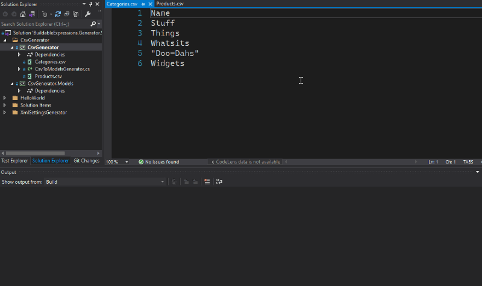

# BuildableExpressions.Generator.Samples

These sample projects demonstrate the **BuildableExpressions.Generator**.

## HelloWorld

- Generates an `OutputAssemblies` class with an `All` property listing the names of the Assemblies in
  the project's output directory

- Demonstrates setting a custom build output message log prefix in `HelloWorld.csproj`

- Demonstrates using the BuildableExpressions
  [source code generation API](https://buildableexpressions.readthedocs.io/api)

- .NET 5.0 Console App

## XmlSettingsGenerator

- Generates one class for each `*.xmlsettings` file in the build output, adding get-only properties
  for each XML element

- Demonstrates using a source code string

- .NET 4.7.2 class library, non-SDK project

## CsvGenerator

- Generates one class for each `*.csv` file in the build output, adding get-set properties for each
  CSV 'column'

- Demonstrates generating output for a different project - `CsvGenerator.csproj` -> `CsvGenerator.Models.csproj`

- Demonstrates using the BuildableExpressions 
  [source code generation API](https://buildableexpressions.readthedocs.io/api)

- .NET Standard 2.0 class library

### CsvGenerator in Action

The below gif shows:

- The input CSV files
- The output files being generating by the build
- The generated output files

